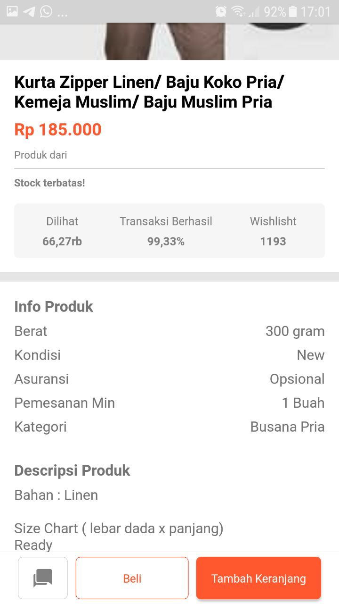
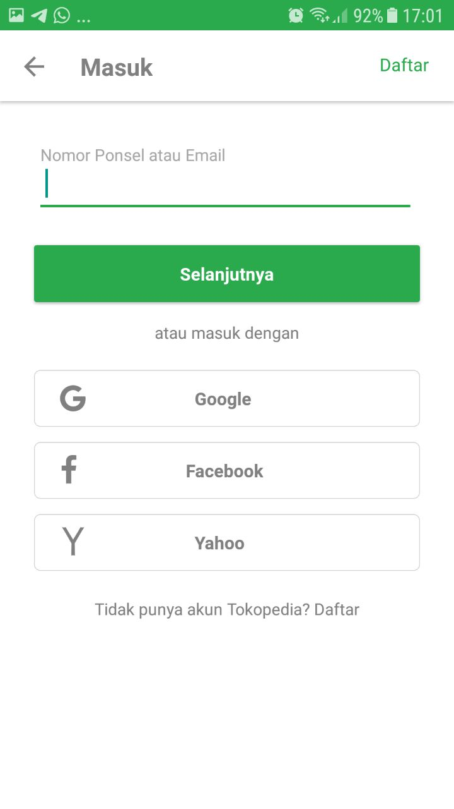

## Tokopedia Clone React Native





## Stack
1. React Navigation
2. Redux
3. Redux Form
4. Redux Promise Middleware
5. Redux Persist
6. React Localization
7. Native Base
8. Axios
9. React Native Swiper

## Get Started

### 1. System Requirements

* Globally installed [node](https://nodejs.org/en/)

* Globally installed [react-native CLI](https://facebook.github.io/react-native/docs/getting-started.html)


### 2. Installation

On the command prompt,run the following commands:

```sh
$ git clone https://github.com/aswara/tokopedia-clone.git

$ cd tokopedia-clone/

$ npm install
  or
  yarn
```

For those of you who doesn't specify the sdk path at the variable environment yet, please adjust the sdk path on the `android/local.properties` file.

### 3. Running on your devices
	* Run the following commands at your favourite terminal:
		* For ios `react-native run-ios` 
		* And android `react-native run-android` 

