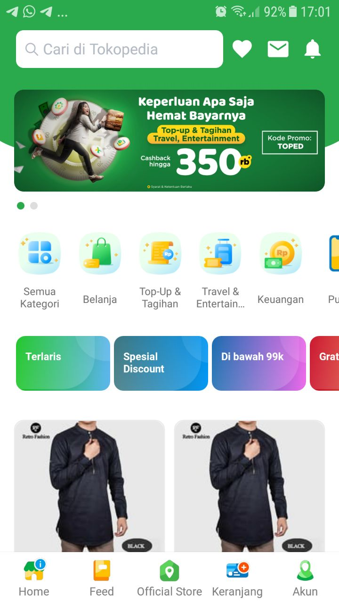

## Tokopedia Clone React Native




## Stack
1. React Navigation
2. Redux
3. Redux Form
4. Redux Promise Middleware
5. Redux Persist
6. React Localization
7. Native Base
8. Axios
9. React Native Swiper

## Get Started

### 1. System Requirements

* Globally installed [node](https://nodejs.org/en/)

* Globally installed [react-native CLI](https://facebook.github.io/react-native/docs/getting-started.html)


### 2. Installation

On the command prompt run the following commands

```sh
$ git clone https://github.com/aswara/tokopedia-clone.git

$ cd tokopedia-clone/

$ npm install
  or
  yarn
```

### Run on iOS

 * Opt #1:
 	* Run `npm start` in your terminal
	* Scan the QR code in your Expo app
 * Opt #2:
	* Run `npm run ios` in your terminal

### Run on Android

  * Opt #1:
	* Run `npm start` in your terminal
	* Scan the QR code in your Expo app
  * Opt #2:
	* Run `npm run android` in your terminal
